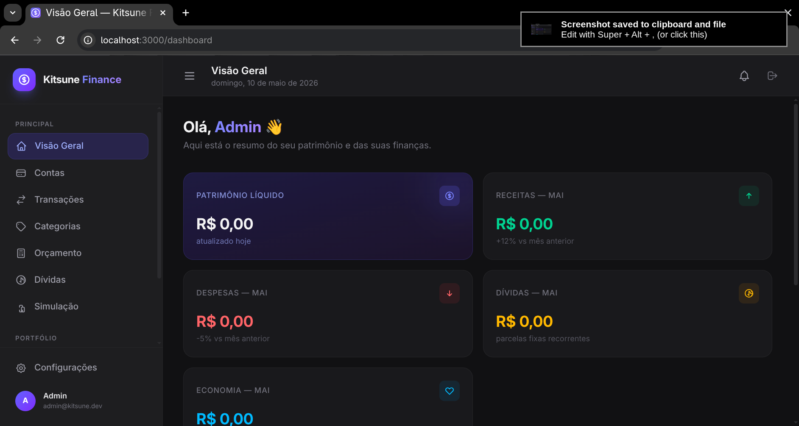
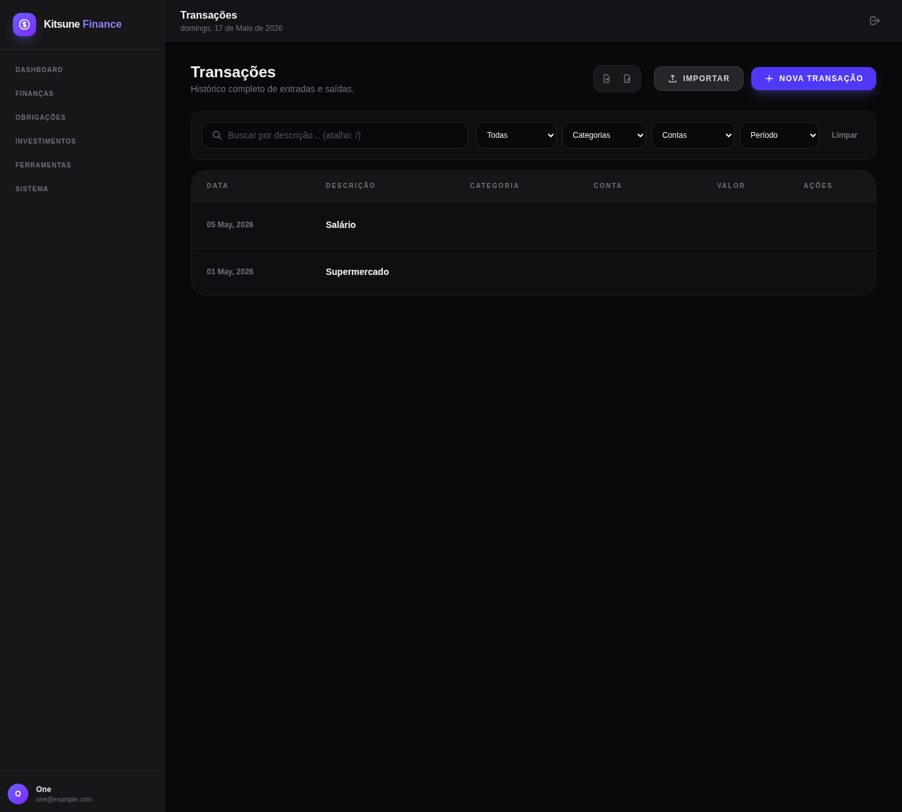
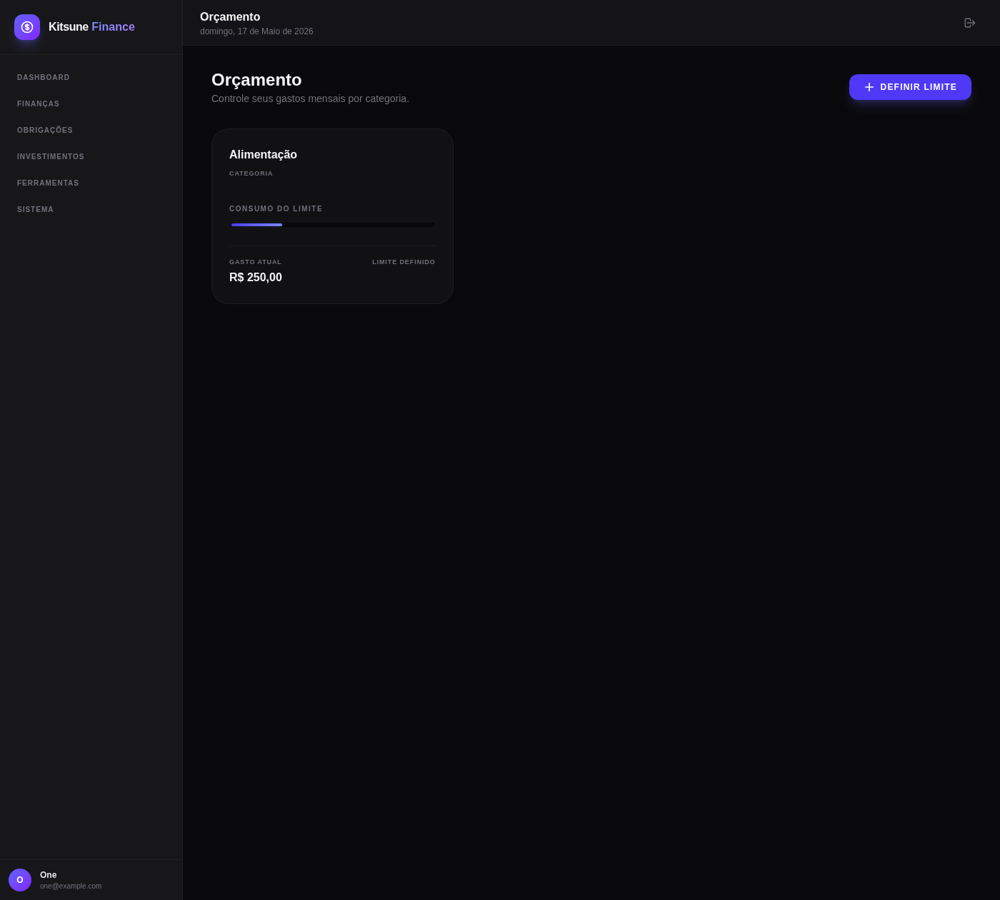
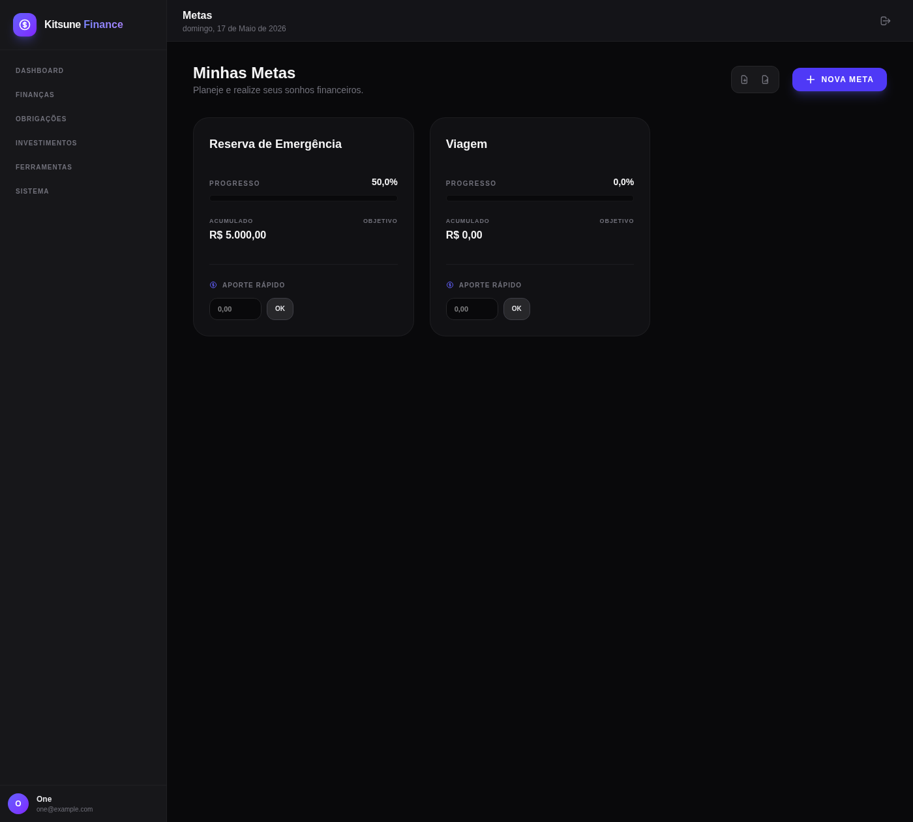
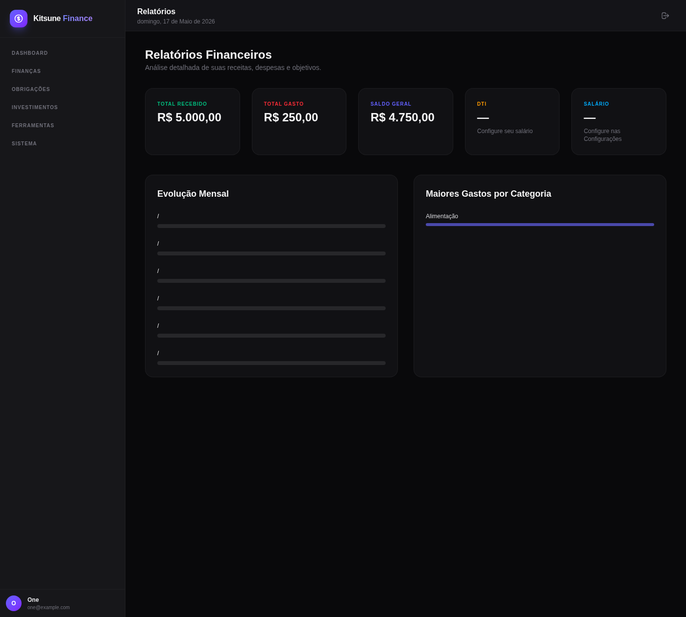

# Kitsune Finance

Kitsune Finance é uma plataforma de gestão financeira pessoal auto-hospedável, construída com Ruby on Rails 8. Foco em controle, organização, simulação de cenários e acompanhamento de investimentos.

## Funcionalidades

* **Painel (Dashboard):** Visão geral unificada com saldo, receitas, despesas, dívidas, health score financeiro, fluxo de caixa (60 dias), alocação de investimentos e atalhos rápidos. Widgets personalizáveis.
* **Contas:** Suporte a múltiplas contas (corrente, poupança, crédito, investimento, dinheiro, carteira) com saldo por conta, cores e ícones personalizados.
* **Transações:** Lançamentos de receita, despesa e transferência entre contas. Suporte a parcelamento, transações recorrentes (diária/semanal/mensal/anual), comprovantes (receipt) e busca global.
* **Importação Inteligente:** Importação de CSV e OFX (extrato bancário) com identificação automática do banco (via BrasilAPI) e auto-categorização baseada em regras por palavra-chave, sugestões e consulta CNPJ/CNAE.
* **Categorias:** Categorias personalizáveis por tipo (receita/despesa) com cores e ícones. Sistema de regras de auto-categorização por palavra-chave.
* **Orçamentos:** Definição de limites mensais por categoria com alertas automáticos em 80% e 100% do limite. Renovação automática mensal.
* **Metas:** Acompanhamento de objetivos de poupança com progresso visual, status (ativo/completo/pausado), prazo e contribuição direta (cria despesa vinculada).
* **Investimentos:** Carteira completa com suporte a ações BR, FIIs, renda fixa, internacionais, criptomoedas, tesouro direto. Controle de trades (compra/venda), preço médio, P&L e feed automático de preços (brapi.dev, Yahoo Finance, CoinGecko, Alpha Vantage, StatusInvest, Fundamentus, Tesouro Direto, URLs personalizadas).
* **Dívidas:** Controle de parcelamentos com cálculo automático de progresso, impacto mensal e processamento mensal via job agendado.
* **Simulação Financeira:** Motor de cenários ("e se...") para projetar o impacto de variações de renda ou corte de despesas no saldo final, quitação de dívidas e cumprimento de metas.
* **Relatórios:** Visão anual com breakdown mensal, distribuição por categoria (top 5), health score e exportação CSV/XLSX.
* **Indicadores Econômicos:** Acompanhamento de Selic, CDI e IPCA (dados atualizados diariamente via API do Banco Central).
* **Notícias Financeiras:** Feed agregado de RSS (InfoMoney, Valor, InvestNews).
* **Câmbio:** Cotações USD/BRL e EUR/BRL em tempo real via AwesomeAPI.
* **Health Score Financeiro:** Pontuação composta (0-100) baseada em DTI, taxa de despesas, taxa de poupança e patrimônio líquido. Recomendações inteligentes geradas automaticamente.
* **Notificações:** Sistema interno de notificações + push externo via ntfy.sh/Gotify. Alertas de feriados, orçamento, metas e processamento de dívidas.
* **Backup e Exportação:** Backup completo em JSON (todos os dados do usuário) e exportação CSV/XLSX de transações e metas.
* **Autenticação:** Cadastro e login com Devise (suporte i18n pt-BR).
* **Personalização:** Tema claro/escuro, customização do dashboard, atalhos de teclado (`n` nova transação, `/` busca, `Ctrl+B` sidebar, `h` health page).
* **PWA:** Suporte a Progressive Web App com manifest e service worker.
* **Design Responsivo:** Interface adaptável para mobile com navegação inferior.

## Stack

| Camada | Tecnologia |
|---|---|
| Framework | Ruby on Rails 8.1 |
| Ruby | 4.0.3 |
| Database | SQLite 3 (primary + cache + queue + cable) |
| Frontend | Importmap, Alpine.js, Chart.js, Tailwind CSS |
| Background Jobs | Solid Queue |
| Cache | Solid Cache |
| WebSocket | Solid Cable |
| Auth | Devise |
| API Clients | Faraday (BrasilAPI, BCB, AwesomeAPI, brapi.dev, Yahoo Finance, CoinGecko) |

## Como rodar

### Requisitos

- Docker e Docker Compose

### Produção (auto-hospedagem)

```bash
# Opcional: configurar chave mestra
echo "RAILS_MASTER_KEY=sua_chave_mestra" > .env

# Build e iniciar
docker compose -f docker-compose.prod.yml up -d --build
```

Acessar em `http://localhost:13522`.

### Desenvolvimento

```bash
./bin/docker-dev
```

### Scripts

- `./bin/docker-build --prod` — Build e start em produção
- `./bin/docker-dev` — Ambiente de desenvolvimento
- `./bin/docker-compose-up` — Helper para docker compose

## Screenshots

### Dashboard


### Transações


### Orçamentos


### Metas


### Relatórios



